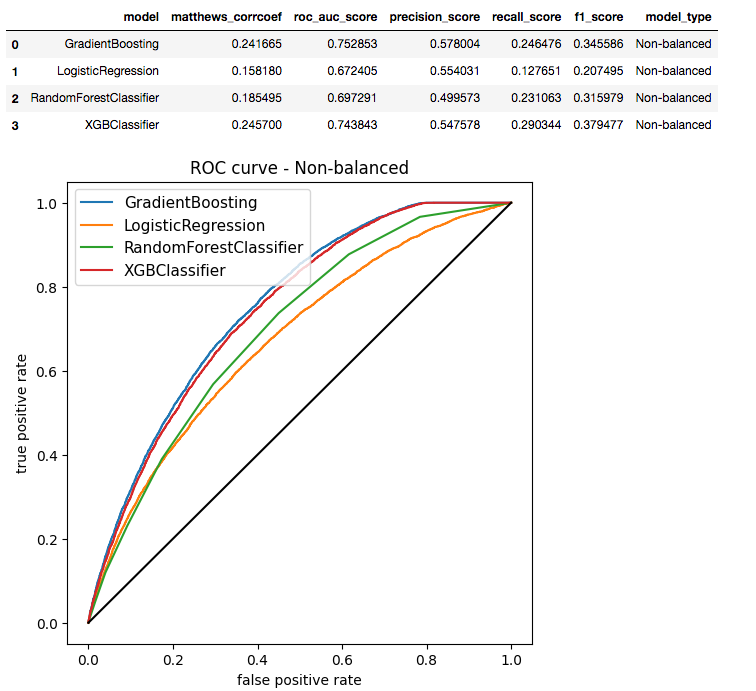

# Loan Eligibility Prediction

### 1. Problem Statement:

Stock Yards Bank & Trust, currently handles loan applications through manual processes. Due to the subjective nature of loan approvals and the influx of applications, making decisions has become challenging. To streamline this, they aim to develop an automated machine learning system to assess various criteria and determine loan approval.

In this project, the goal is to create a classification model to decide if a loan should be granted. We'll consider several factors, such as the applicant's credit rating and previous loan history, to predict their eligibility. Data cleaning will be essential, filling gaps and ensuring the model's reliability. The end result will provide a probability score, indicating either "Loan Approved" or "Loan Denied" based on the model's analysis. Code for the projects is in "SW_pred.ipynb"

### 2. Data Description
- **Loan ID:** Loan ID (uique id)
- **Customer ID:** (non-unique, single customer can have multiple loan records)
- **Loan Status:** Target binary metric, Loan Given/Loan Refused.
- **Term:** Binary, short/long
- **Credit Score:** Credit score 0~800
- **Years in current job:** Ordered
- **Home Ownership:** Categorical, ex) Rent, Own
- **Annual Income:** Annual income in US dollars
- **Monthly Debt:** Monthly Debt in US dollars
- **Years of Credit History:** in years
- **Months since last delinquent:** in months
- **Number of Open Accounts:** Count in positive integer
- **Number of Credit Problems:** Count in positive integer, Zero inflated
- **Current Credit Balance:** in US dollars
- **Maximum Open Credit:** in US dollars
- **Bankruptcies:** Binary, 0/1
- **Tax Liens:** Binary, 0/1

### 3. Data Prep and EDA
As the target variable for the modeling is "Loan Status", we need to examine this feature closely. Since this feature is binary, the modeling problem will be a classification task. The data is not balanced, though it's not severely imbalanced either. In subsequent sections, we will work with the raw imbalanced data and also explore resampling methods to achieve balance.

Soft impute is used to address missing values. Additionally, outliers were removed and the data was winsorized. For instance, in the credit score feature, some data had four-digit scores instead of the typical three-digit scores. These discrepancies were corrected before modeling. Below is a histogram illustrating the credit score distribution after cleaning. There's a peak at one point, representing the default credit score. Such a distribution is expected.

### 4. Modeling and Evaluation

Here is a feature importance plot that illustrates which features contribute to the prediction, ranked by importance. The loan amount emerges as the most significant predictor. Intuitively, this aligns with the notion that securing a loan becomes more challenging as the amount increases. You can examine the plot further to understand how other features impact the model.

### 5. Results

The results from the test dataset with imbalanced data indicate that boosting-based methods (specifically, Gradient Boosting and XGBoost) outperform both Random Forest and Logistic Regression. While XGBoost is an advanced version of Gradient Boosting with added regularization, the outcomes for both XGBoost and Gradient Boosting were similar.

From the results using a balanced test dataset, boosting-based methods (such as Gradient Boosting and XGBoost) and logistic regression outperform Random Forest. This can be attributed to the fact that logistic regression models tend to be conservative, leaning more towards identifying outcomes as denials.

In summarizing all the results, Gradient Boosting and XGBoost prove to be the most effective. For now, Gradient Boosting will be our choice since it's a lighter model, allowing for quicker execution with reduced memory usage. I've created a .pkl file to facilitate the model's deployment in the actual application. The deployment process will be continued in a subsequent project."

